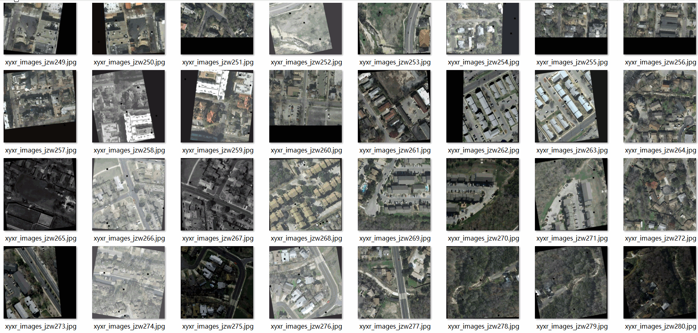

# High-Altitude Aerial Ground Building Dataset 7682 images VOC+YOLO format

The aerial ground building dataset, comprising 7682 images in VOC+YOLO format, is available for download. This dataset follows the Pascal VOC format but also includes YOLO formatted files, excluding the split path txt file which only contains JPG images along with their corresponding VOC and YOLO formatted txt files.

The number of images (JPG files) is: 7682

The number of annotations (XML files) is: 7682

The number of annotations (TXT files) is: 7682

The number of categories: 1

The GitHub repository where the dataset can be found is: datasets_sl

The category name for the annotations is ["building"]

The number of boxes per category is as follows:

- "building" box count = 104012
- Total box count = 104012
- The number of images per category is as follows:
- "building" images = 7682
- Image resolution is 640x640

Annotation tools used are labelImg and YOLO.

The dataset has been enhanced.

Annotation rules specify that each category should have a box drawn around it.

Important Notice: The dataset does not include partitioning into training, validation, or test sets; users must perform this themselves.

Special Remarks: This dataset does not guarantee any accuracy for models trained on it or the weights files.

## Images

---

Here is a pay link on Stripe (https://buy.stripe.com/3cs8yP7sY87d0vu9AB). Please contact me lonlonago@foxmail.com after funding $89, and I will send you a complete data files, thank you!

